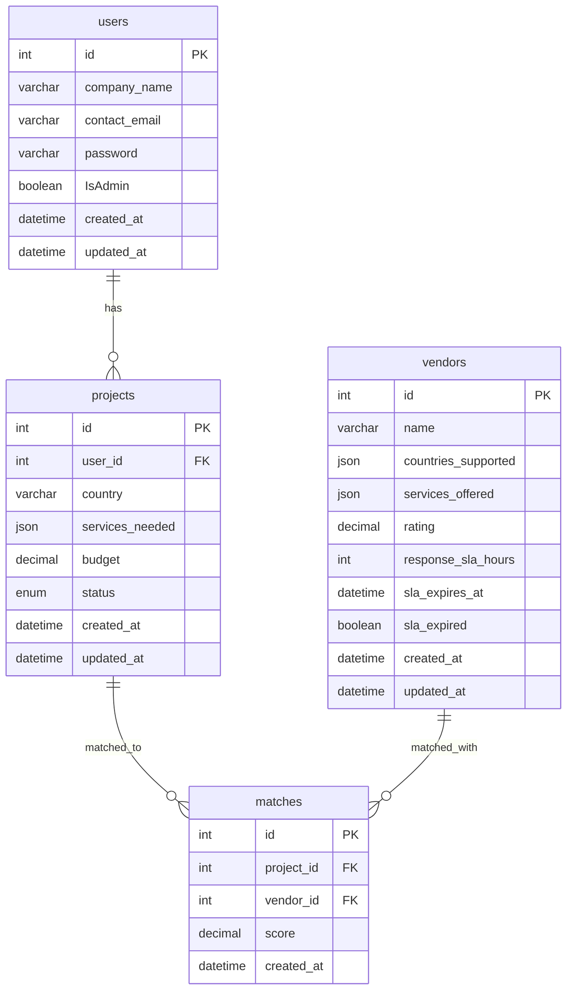

# Expander360 - Project-Vendor Matching Platform

A comprehensive NestJS-based platform that intelligently matches projects with vendors based on geographical location, service requirements, vendor ratings, and response SLA.

## 🚀 Quick Start

### Prerequisites

- Nest.js (v18+ recommended)
- MySQL (v8.0+)
- MongoDB (v6.0+)
- npm or yarn

### Installation

```bash
# Clone the repository
git clone <repository-url>
cd expander360

# Install dependencies
npm install

# Set up environment variables
cp .env.example .env
# Edit .env with your database credentials
```

### Environment Variables

Create a `.env` file in the root directory:

```env
# MySQL Database
DB_HOST=localhost
DB_PORT=3306
DB_USERNAME=root
DB_PASSWORD=admin
DB_NAME=expander360

# MongoDB
MONGODB_URI=mongodb://localhost:27017
MONGODB_DATABASE=expander360_analytics

# JWT
JWT_SECRET=your-super-secret-jwt-key
JWT_EXPIRES_IN=24h

# Application
PORT=3000
NEST_ENV=development
```

### Database Setup

1. **Run Migrations**:

```bash
npm run migration:run
```

2. **Seed Database with Test Data**:

```bash
# Seed both MySQL and MongoDB
npm run seed

# Or seed individually
npm run seed:mysql
npm run seed:mongodb
```

3. **Start the Application**:

```bash
# Development mode
npm run start:dev

# Production mode
npm run start:prod
```

## 📊 Database Schema

### MySQL Schema (Relational Data)



### MongoDB Schema (Analytics & Reports)

**Analytics Collection**:

```javascript
{
  timestamp: Date,
  event_type: String, // 'user_registration', 'project_created', 'match_generated', etc.
  user_id: Number,
  project_id: Number,
  vendor_id: Number,
  match_id: Number,
  metadata: {
    ip_address: String,
    user_agent: String,
    session_id: String,
    // Additional event-specific data
  }
}
```

**Reports Collection**:

```javascript
{
  report_id: String,
  title: String,
  type: String, // 'project_performance', 'vendor_analytics', etc.
  generated_at: Date,
  generated_by: Number,
  data: Object, // Report-specific data structure
  filters: Object // Applied filters for the report
}
```

## 🔗 API Endpoints

### Authentication

All endpoints (except registration/login) require JWT authentication:

```
Authorization: Bearer <jwt_token>
```

### Users API

| Method | Endpoint          | Description       | Access      |
| ------ | ----------------- | ----------------- | ----------- |
| POST   | `/users/register` | Register new user | Public      |
| POST   | `/users/login`    | User login        | Public      |
| GET    | `/users`          | Get all users     | Admin       |
| GET    | `/users/:id`      | Get user by ID    | Admin/Owner |
| PATCH  | `/users/:id`      | Update user       | Admin/Owner |
| DELETE | `/users/:id`      | Delete user       | Admin       |

### Projects API

| Method | Endpoint              | Description              | Access       |
| ------ | --------------------- | ------------------------ | ------------ |
| GET    | `/projects`           | Get all projects         | Client/Admin |
| GET    | `/projects?user_id=1` | Get projects by user     | Client/Admin |
| POST   | `/projects`           | Create project           | Client/Admin |
| GET    | `/projects/:id`       | Get project with matches | Client/Admin |
| PATCH  | `/projects/:id`       | Update project           | Client/Admin |
| DELETE | `/projects/:id`       | Delete project           | Client/Admin |

### Vendors API

| Method | Endpoint          | Description                | Access       |
| ------ | ----------------- | -------------------------- | ------------ |
| GET    | `/vendors`        | Get all vendors            | Client/Admin |
| GET    | `/vendors/search` | Search vendors by criteria | Client/Admin |
| POST   | `/vendors`        | Create vendor              | Admin        |
| GET    | `/vendors/:id`    | Get vendor by ID           | Client/Admin |
| PATCH  | `/vendors/:id`    | Update vendor              | Admin        |
| DELETE | `/vendors/:id`    | Delete vendor              | Admin        |

### Matches API

| Method | Endpoint                | Description            | Access       |
| ------ | ----------------------- | ---------------------- | ------------ |
| GET    | `/matches`              | Get all matches        | Client/Admin |
| GET    | `/matches?project_id=1` | Get matches by project | Client/Admin |
| GET    | `/matches?vendor_id=1`  | Get matches by vendor  | Client/Admin |
| GET    | `/matches?top=10`       | Get top matches        | Client/Admin |
| POST   | `/matches`              | Create manual match    | Admin        |
| GET    | `/matches/:id`          | Get match by ID        | Client/Admin |
| PATCH  | `/matches/:id`          | Update match           | Admin        |
| DELETE | `/matches/:id`          | Delete match           | Admin        |

### Analytics API

| Method | Endpoint             | Description           | Access |
| ------ | -------------------- | --------------------- | ------ |
| GET    | `/analytics/events`  | Get analytics events  | Admin  |
| GET    | `/analytics/reports` | Get generated reports | Admin  |
| POST   | `/analytics/reports` | Generate new report   | Admin  |

## 🎯 Matching Algorithm

The platform uses a sophisticated scoring algorithm to match projects with vendors:

### Scoring Formula

```
Final Score = (Services Overlap × 2) + Vendor Rating + SLA Weight
```

### Components

1. **Services Overlap** (0-N points, multiplied by 2):
   - Counts how many required services the vendor offers
   - Each matching service adds 1 point (then multiplied by 2)

2. **Vendor Rating** (0-5 points):
   - Direct addition of vendor's rating (0.00 to 5.00)

3. **SLA Weight** (0-100 points):
   - Formula: `max(0, 100 - (response_sla_hours × 2))`
   - Faster response times get higher scores
   - Example: 2 hours SLA = 96 points, 24 hours SLA = 52 points

### Geographic Filtering

- Only vendors that serve the project's country are considered
- Country overlap is mandatory (binary filter, not scored)

### Score Range

- Final scores are clamped between 0 and 100
- Scores above 90 are considered "excellent matches"
- Scores 70-89 are "good matches"
- Scores 50-69 are "fair matches"
- Scores below 50 are "poor matches"

### Example Calculation

**Project Requirements:**

- Country: USA
- Services: [web_development, ui_ux_design]
- Budget: $50,000

**Vendor A:**

- Countries: [USA, Canada, UK]
- Services: [web_development, ui_ux_design, digital_marketing]
- Rating: 4.8
- SLA: 12 hours

**Calculation:**

- Services Overlap: 2 (both web_development and ui_ux_design match)
- Score: (2 × 2) + 4.8 + (100 - 12×2) = 4 + 4.8 + 76 = **84.8**

## 🧪 Testing

### Test Data Overview

The seeding script creates realistic test data including:

**Users (7 total)**:

- 6 client companies (TechCorp, Digital Innovations, etc.)
- 1 admin user

**Vendors (10 total)**:

- Overlapping country support to test matching logic
- Various service combinations
- Different ratings and SLA times

**Projects (12 total)**:

- Distributed across multiple countries
- Various service requirements and budgets
- Different project statuses

**Matches (47 total)**:

- Generated using the actual matching algorithm
- Realistic score distributions

### Country Overlap Testing

The seed data includes strategic overlaps:

- USA: Supported by 8 vendors (most overlap)
- UK: Supported by 6 vendors
- Germany: Supported by 5 vendors
- Multiple vendors support the same country combinations

This ensures robust testing of the matching algorithm with realistic scenarios.

### Running Tests

```bash
# Unit tests
npm run test

# E2E tests
npm run test:e2e

# Test coverage
npm run test:cov
```

## 🛠 Development

### Project Structure

```
src/
├── analytics/          # Analytics and reporting
├── common/
│   └── enums/          # Shared enumerations
├── database/
│   └── migrations/     # SQL migration files
├── matches/            # Project-vendor matching logic
├── MySQL/              # MySQL database configuration
├── notifications/      # Email and notification services
├── projects/           # Project management
├── reports/            # Report generation
├── tasks/              # Background tasks
├── users/              # User management and authentication
├── vendors/            # Vendor management
└── Validators/         # Custom validation decorators

scripts/
├── seed-all.ts         # Complete database seeding
├── seed-database.ts    # MySQL seeding
├── seed-mongodb.ts     # MongoDB seeding
└── run-migrations.ts   # Migration runner
```

### Code Quality

```bash
# Linting
npm run lint

# Code formatting
npm run format
```

### Adding New Features

1. Create feature module: `nest g module feature-name`
2. Add entities, DTOs, controllers, and services
3. Update database schema if needed
4. Add tests
5. Update API documentation

## 🌐 Deployment

### Environment Setup

1. **Production Database**:
   - Set up MySQL and MongoDB instances
   - Update environment variables
   - Run migrations: `npm run migration:run`

2. **Application Deployment**:

```bash
# Build the application
npm run build

# Start in production mode
npm run start:prod
```

### Docker Deployment (Optional)

```dockerfile
# Example Dockerfile
FROM node:18-alpine
WORKDIR /app
COPY package*.json ./
RUN npm ci --only=production
COPY dist/ ./dist/
EXPOSE 3000
CMD ["npm", "run", "start:prod"]
```

### Health Checks

The application exposes health check endpoints:

- `GET /health` - Application health status
- `GET /health/database` - Database connectivity status

## 📈 Monitoring & Analytics

### Built-in Analytics

The platform tracks various events:

- User registrations and logins
- Project creation and updates
- Vendor interactions
- Match generation and viewing
- API calls and performance metrics

### Available Reports

1. **Project Performance**: Success rates, budget analysis, service trends
2. **Vendor Analytics**: Top performers, response times, service coverage
3. **Matching Efficiency**: Score distributions, algorithm performance
4. **User Activity**: Engagement metrics, geographic distribution

### Custom Reports

Generate custom reports via the Analytics API:

```bash
POST /analytics/reports
{
  "type": "custom",
  "title": "Monthly Performance Report",
  "filters": {
    "date_range": "2024-01-01 to 2024-01-31",
    "countries": ["USA", "UK"],
    "min_budget": 50000
  }
}
```

## 🤝 Contributing

1. Fork the repository
2. Create a feature branch: `git checkout -b feature-name`
3. Make your changes and add tests
4. Ensure all tests pass: `npm run test`
5. Commit your changes: `git commit -am 'Add new feature'`
6. Push to the branch: `git push origin feature-name`
7. Create a Pull Request

## 📝 License

This project is licensed under the MIT License - see the [LICENSE](LICENSE) file for details.

## 🆘 Support

For support and questions:

- Create an issue in the GitHub repository
- Contact the development team at dev@expander360.com

---

**Live Demo**: [https://expander360.herokuapp.com](https://expander360.herokuapp.com) _(Replace with actual deployment URL)_

_Last updated: December 2024_
